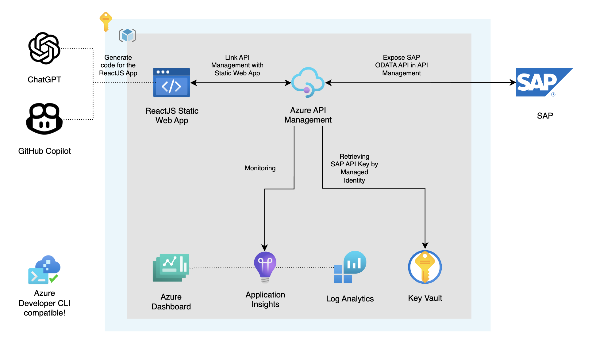

[](https://codespaces.new/pascalvanderheiden/ais-apim-odata-reactjs)
[](https://vscode.dev/redirect?url=vscode://ms-vscode-remote.remote-containers/cloneInVolume?url=https://github.com/pascalvanderheiden/ais-apim-odata-reactjs)

## Build Status

| GitHub Action | Status |
| ----------- | ----------- |
| AZD Deploy | [](https://github.com/pascalvanderheiden/ais-apim-openai/actions/workflows/azure-dev.yml) |

## About
Expose your SAP OData APIs via Azure API Management and link it with Azure Static Web App to create a serverless web application blazing fast with GitHub Copilot or ChatGPT.

Because I'm not a ReactJS developer, I used ChatGPT to generate the code and link it to SAP ODATA API via API Management. I've included the generated code in this repository, so you can see how it works. This is also the code which will be deployed to Azure Static Web App. After I published this repository, GitHub Copilot X came available, so I've used it to generate the code for the Azure Static Web App in the same way as I did with ChatGPT. The big benefit of GitHub Copilot is, is that you don't need to leave your development environment and have the copilot by your side helping you to finetune your application further. You can find more information about GitHub Copilot X [here](https://copilot.github.com/).

I've "reorganized" this repository to make it Azure Developer CLI (AZD) compatible. I've used the Azure Developer CLI Bicep Starter template to create the AZD foundational files. With AZD you can create a new repository with a fully functional CI/CD pipeline in minutes. You can find more information about AZD [here](https://learn.microsoft.com/en-us/azure/developer/azure-developer-cli/).

One of the key points of AZD templates is that we can implement best practices together with our solution when it comes to security, network isolation, monitoring, etc. Users are free to define their own best practices for their dev teams & organization, so all deployments are followed by the same standards.

Hope you like it. If you have any questions, please let me know.

The following assets have been provided:

- Infrastructure-as-code (IaC) Bicep files under the `infra` folder that demonstrate how to provision resources and setup resource tagging for azd.
- A [dev container](https://containers.dev) configuration file under the `.devcontainer` directory that installs infrastructure tooling by default. This can be readily used to create cloud-hosted developer environments such as [GitHub Codespaces](https://aka.ms/codespaces).
- Continuous deployment workflows for CI providers such as GitHub Actions under the `.github` directory, and Azure Pipelines under the `.azdo` directory that work for most use-cases.

## Architecture



## Prerequisites

- Install [REST Client](https://marketplace.visualstudio.com/items?itemName=humao.rest-client) Extension for Visual Studio Code.
- [Azure Developer CLI](https://docs.microsoft.com/en-us/azure/developer/azure-developer-cli/)
- Install [NodeJS with NPM](https://nodejs.org/en/download/)

## SAP ODATA API

You can setup your own SAP ODATA API in minutes by following these steps in this [tutorial](https://developers.sap.com/tutorials/gateway-demo-signup.html). You can find the API documentation [here](https://api.sap.com/api/API_BUSINESS_PARTNER/overview). You can test the API [here](https://api.sap.com/api/API_BUSINESS_PARTNER/tryout).

## Next Steps

### Step 1: Initialize a new `azd` environment

```shell
azd init
```

It will prompt you to provide a name that will later be used in the name of the deployed resources.
If you don't what to clone or fork the repository, you can use the following command to create a new repository with the same content as this repository:

```shell
azd init -t https://github.com/pascalvanderheiden/ais-apim-odata-reactjs
```

### Step 2: Set SAP environment variables

```shell
azd env set SAP_ENDPOINT '<your-sap-url>'
azd env set SAP_APIKEY '<your-sap-api-key>'
```

If you used the SAP Sandbox environment as mentioned above, the SAP_ENDPOINT is https://sandbox.api.sap.com/s4hanacloud/sap/opu/odata/sap/API_BUSINESS_PARTNER.

### Step 3: Provision and deploy all the resources

```shell
azd up
```

It will prompt you to login, pick a subscription, and provide a location (like "westeurope"). Then it will provision the resources in your account and deploy the latest code.

For more details on the deployed services, see [additional details](#additional-details) below.

## CI/CD pipeline

This project includes a Github workflow and a Azure DevOps Pipeline for deploying the resources to Azure on every push to main. That workflow requires several Azure-related authentication secrets to be stored as Github action secrets. To set that up, run:

```shell
azd pipeline config
```

## Monitoring

The deployed resources include a Log Analytics workspace with an Application Insights dashboard to measure metrics like server response time.

To open that dashboard, run this command once you've deployed:

```shell
azd monitor --overview
```

## Create a ReactJS app with ChatGPT

I've used [ChatGPT](https://chat.openai.com/) to generate the ReactJS code. You can find the generated code in [this folder](./src/react-odata-app).

First I asked ChatGPT: How do I create a reactjs app?


```ps1
npm install -g create-react-app
npx create-react-app <app_name>
cd <app_name>
npm start
```
I just pasted these commands in the terminal in Visual Studio Code.


And, voila! You have a ReactJS app running locally.


Then I asked ChatGPT a couple of questions to generate the code that I wanted:

* First: Can you add a button on this app.js file? And just pasted the code from the boilerplate.
* Second: When you click the button, show a list of BusinessPartners, showing the BusinessPartner and the BusinessPartnerFullName from this api <url of my static web app api>.
When I saved the code it showed the list straight away. And this is not what I wanted.
* Third: It now shows the list straight away. Can you adjust the code so it would show the list, when you click the button and hide the list by adding a second button? 

It gave me a spot on answer, and I just copied the code and pasted it in the App.js file.


Here is the final code:

```js
import { useState, useEffect } from 'react';
import logo from './logo.svg';
import './App.css';

function App() {
  const [businessPartners, setBusinessPartners] = useState([]);
  const [showBusinessPartners, setShowBusinessPartners] = useState(false);

  useEffect(() => {
    async function fetchBusinessPartners() {
      const response = await fetch('<url of my static web app api>');
      const data = await response.json();
      setBusinessPartners(data.d.results);
    }
    fetchBusinessPartners();
  }, []);

  function handleShowBusinessPartnersClick() {
    setShowBusinessPartners(true);
  }

  function handleHideBusinessPartnersClick() {
    setShowBusinessPartners(false);
  }

  return (
    <div className="App">
      <header className="App-header">
        
        <p>
          Edit <code>src/App.js</code> and save to reload.
        </p>
        {!showBusinessPartners && (
          <button onClick={handleShowBusinessPartnersClick}>
            Show Business Partners
          </button>
        )}
        {showBusinessPartners && (
          <div>
            <button onClick={handleHideBusinessPartnersClick}>
              Hide Business Partners
            </button>
            <ul>
              {businessPartners.map((bp) => (
                <li key={bp.BusinessPartner}>
                  {bp.BusinessPartner} - {bp.BusinessPartnerFullName}
                </li>
              ))}
            </ul>
          </div>
        )}
        <a
          className="App-link"
          href="https://reactjs.org"
          target="_blank"
          rel="noopener noreferrer"
        >
          Learn React
        </a>
      </header>
    </div>
  );
}

export default App;
```

If you are happy with the code, you can build the ReactJS app:

```ps1
npm run build
```

Commit the code to the repository and push it to GitHub. Azure Developer CLI will pick up the changes and deploy the code to the static web app.

This is amazing! This will save me so much time.

## Remove the APIM Soft-delete

If you deleted the deployment via the Azure Portal, and you want to run this deployment again, you might run into the issue that the APIM name is still reserved because of the soft-delete feature. You can remove the soft-delete by using this script:

```ps1
$subscriptionId = "<your-subscription-id>"
$apimName = "<your-apim-name>"
Connect-AzAccount
Set-AzContext -Subscription $subscriptionId
.\del-soft-delete-apim.ps1 -subscriptionId $subscriptionId -apimName $apimName
```

## Testing

I've included a [tests.http](tests.http) file with relevant tests you can perform, to check if your deployment is successful. You need a subcription key in API Management in order to test the API. You can find more information about how to get a subscription key [here](https://docs.microsoft.com/en-us/azure/api-management/api-management-howto-create-subscriptions#add-a-subscription-key-to-a-user).

## Additional Details

The following section examines different concepts that help tie in application and infrastructure.

### Azure API Management

[Azure API Management](https://azure.microsoft.com/en-us/services/api-management/) is a fully managed service that enables customers to publish, secure, transform, maintain, and monitor APIs. It is a great way to expose your APIs to the outside world in a secure and manageable way.

### Azure Static Web App

[Azure Static Web Apps](https://azure.microsoft.com/en-us/services/app-service/static/) is a service that allows you to host static web apps. It is a great way to host your front-end applications.

### Managed identities

[Managed identities](https://learn.microsoft.com/en-us/azure/active-directory/managed-identities-azure-resources/overview) allows you to secure communication between services. This is done without having the need for you to manage any credentials.

### Azure Key Vault

[Azure Key Vault](https://learn.microsoft.com/en-us/azure/key-vault/general/overview) allows you to store secrets securely. Your application can access these secrets securely through the use of managed identities.

### Application Insights

[Application Insights](https://azure.microsoft.com/en-us/services/monitor/) allows you to monitor your application. You can use this to monitor the performance of your application.

### Log Analytics

[Log Analytics](https://azure.microsoft.com/en-us/services/monitor/) allows you to collect and analyze telemetry data from your application. You can use this to monitor the performance of your application.

## Like this project?

If you like this project, please give it a star. If you have any questions, please create an issue.
Thanks for reading!